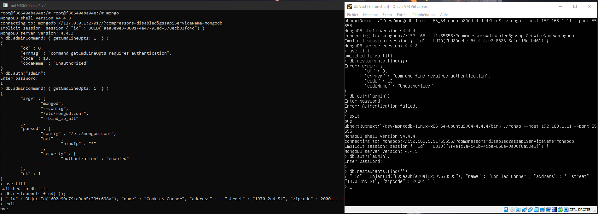
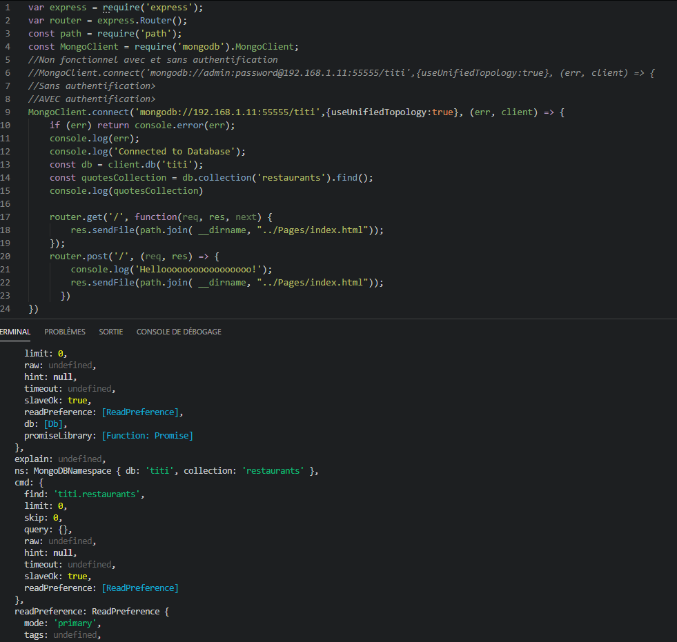
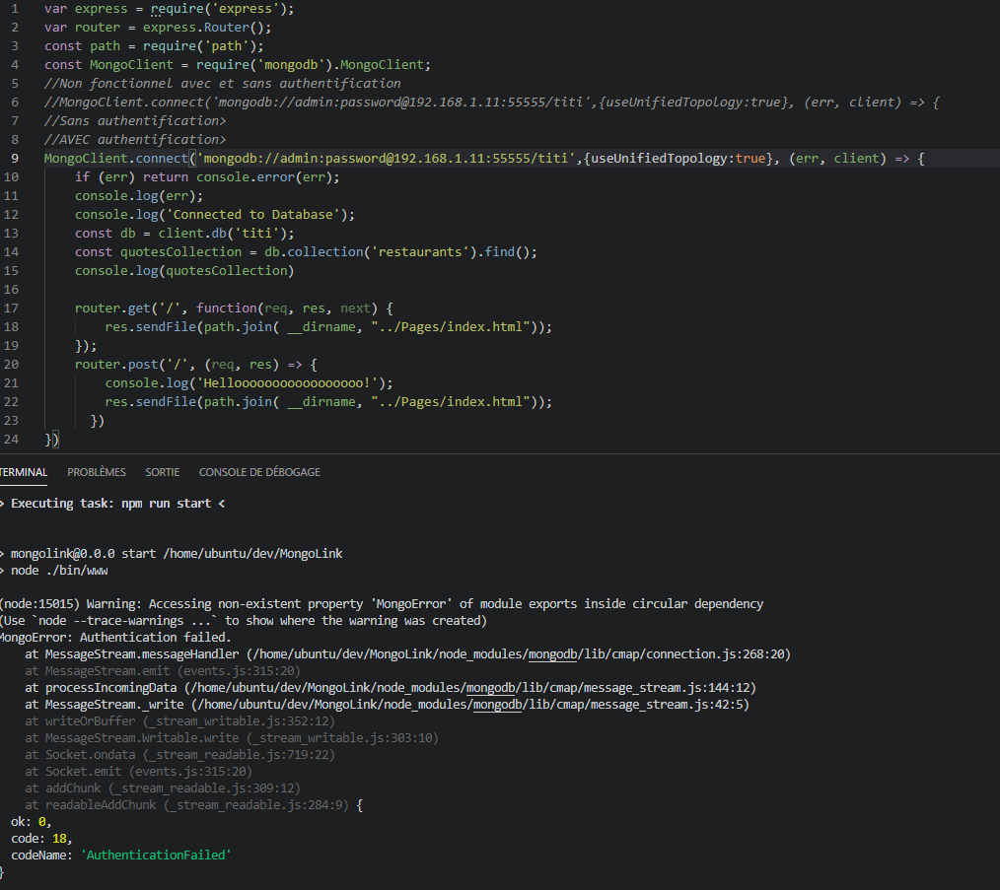

# Test ExpressJS et Authntification MongoDB #
```bash
express MongoLink --view pug 
cd MongoLink
npm install 
npm --local install mongodb
```

*Ici les consoles, à gauche celle du client distant et sur la machine elle-même à droite*
*<br/>On voit que l'authentification est bien demandée*


## Pour tester, lancer le serveur expressjs puis regardez dans la console, si ça marche la console sera pleine à craquer, sinon une erreur apparaît. ##


Sans authentification             |  Avec Authentification
:-------------------------:|:-------------------------:
  |  
*Ici c'est l'inverse fonctionnel d'au-dessus,sans authentification la requête est valide ET executé, alors qu'en étant authentifié, une erreur survient*

La configuration mongo est standard:

```yaml
net: 
    bindIp: 0.0.0.0
    bindIpAll : true
security:
    authorization: enabled
```
Avec :
```JS
use admin
db.createUser({
    user:"myadmin",
    pwd:"secret",
    roles:[{role:"root",db:"admin"}]
})
```
  